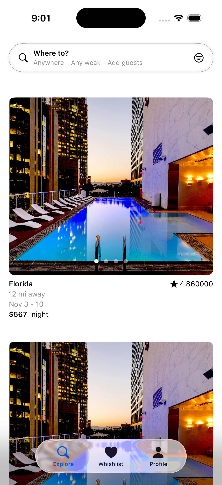
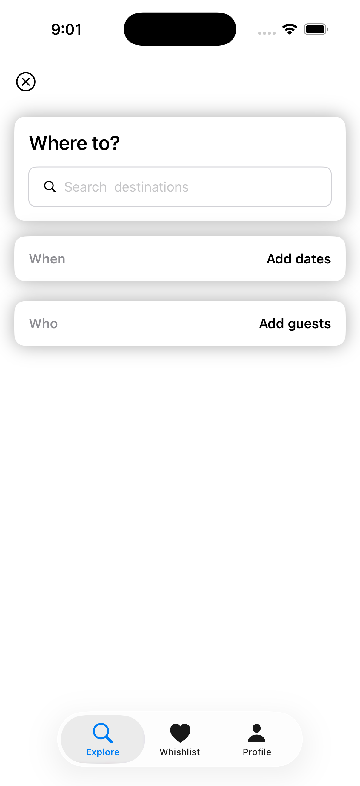
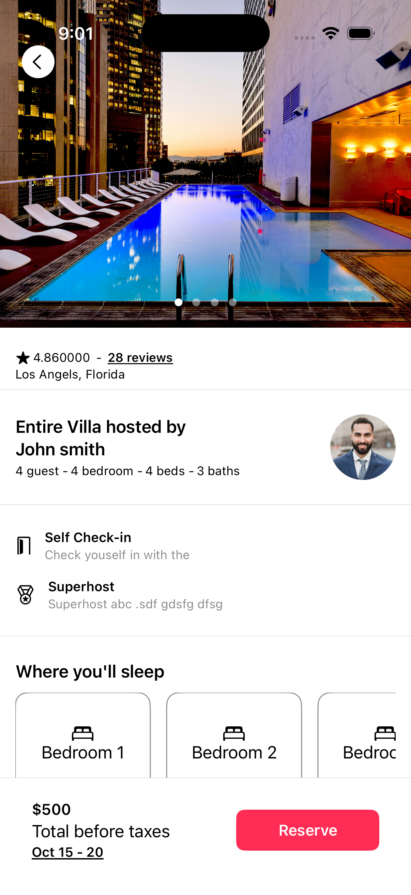
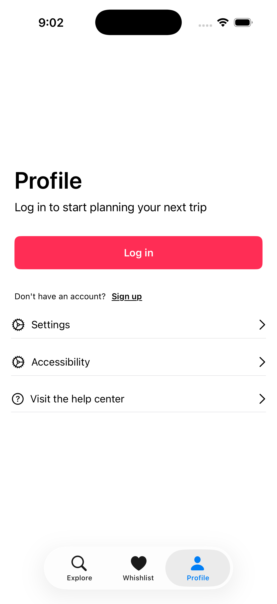

# 🏡 Airbnb Clone - SwiftUI

A modern Airbnb-inspired iOS application built entirely with **SwiftUI**.

The project recreates the core user experience of Airbnb, including property listings, search, property details, image carousel, profile screen, and custom tab navigation.

It demonstrates modern SwiftUI development, reusable UI components, and clean project organization.

---

## 📱 Screenshots

| Explore | Search |
|---------|--------|
|  |  |

| Property Details | Amenities |
|-----------------|-----------|
|  |  |

| Profile |
|---------|
|  |

---

# ✨ Features

- 🏠 Property Listings
- 🔍 Destination Search
- 🖼 Image Carousel
- ⭐ Property Ratings
- 📍 Property Location
- 🛏 Room & Guest Details
- 🏡 Amenities Section
- 🗺 Map Preview
- ❤️ Wishlist Tab
- 👤 Profile Screen
- 📱 Custom Bottom Navigation
- 🎨 Fully Responsive SwiftUI Layout

---

# 🛠 Technologies

- Swift 5
- SwiftUI
- MVVM Architecture
- NavigationStack
- SF Symbols
- Xcode

---

# 📂 Project Structure

```
AirbnbClone
│
├── App
│   └── AirbnbCloneApp.swift
│
├── Core
│   ├── Components
│   │   └── ListingImageCarouselView.swift
│   │
│   ├── Explore
│   │   ├── Service
│   │   ├── ViewModel
│   │   ├── DestinationSearchView.swift
│   │   ├── ExploreView.swift
│   │   └── SearchAndFilterBar.swift
│   │
│   ├── Listing
│   │   ├── Model
│   │   ├── ListingItemView.swift
│   │   └── ListingDetailView.swift
│   │
│   ├── Profile
│   ├── Wishlist
│   └── Tabbar
│
├── Extensions
│
└── Assets
```

---

# 🚀 Key Features

### 🏠 Explore Listings

Browse available properties with:

- Property images
- Price
- Ratings
- Distance
- Available dates

---

### 🔍 Search Destination

Search interface inspired by Airbnb allowing users to choose:

- Destination
- Travel Dates
- Number of Guests

---

### 🏡 Property Details

Detailed listing page including:

- Image Carousel
- Host Information
- Ratings
- Amenities
- Bedrooms
- Interactive Map
- Reservation Section

---

### 👤 Profile

Simple profile interface including:

- Login Screen
- Settings
- Accessibility
- Help Center

---

# 📚 What I Learned

This project helped me improve my understanding of:

- SwiftUI
- NavigationStack
- TabView
- ScrollView
- LazyVStack
- Custom Components
- MVVM
- View Composition
- State Management
- Image Carousel
- Layout System
- Modular Project Structure

---

# ▶️ Getting Started

### Requirements

- Xcode 15+
- iOS 17+
- Swift 5.9+

### Installation

```bash
git clone https://github.com/sandeep9607/AirbnbClone.git
```

Open the project in Xcode and run it on an iOS Simulator or a physical device.

---

# 📦 Project Highlights

- Clean folder organization
- Reusable SwiftUI components
- Airbnb-inspired UI
- Component-based design
- Scalable architecture
- Easy to extend

---

# 🔮 Future Improvements

- Firebase Authentication
- Property Search API
- Interactive Maps
- Booking Flow
- Favorites Persistence
- Image Caching
- Unit Tests
- Dark Mode
- SwiftData Integration
- Offline Support

---

# 👨‍💻 Author

**Sandeep Maurya**

Senior iOS Engineer

- Swift
- SwiftUI
- UIKit
- Combine
- Swift Concurrency
- Clean Architecture

If you found this project useful, consider giving it a ⭐.
